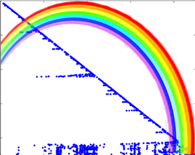
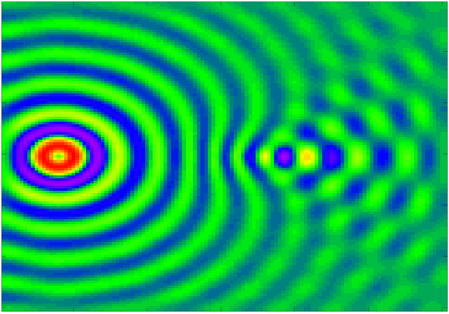
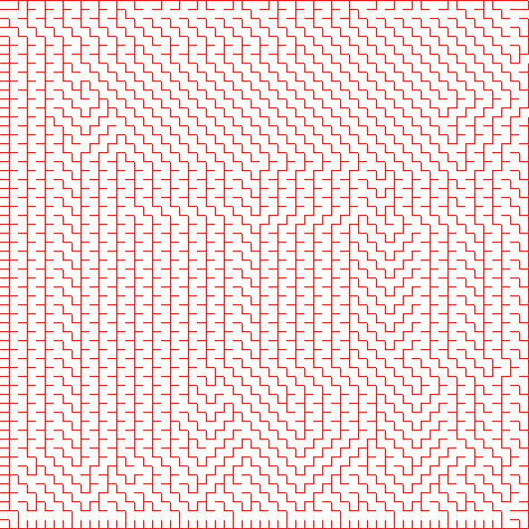
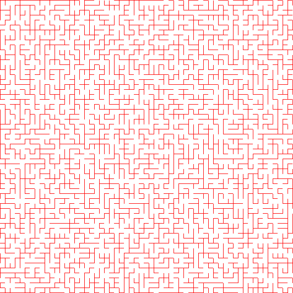

[**catamari**](https://hodgestar.com/catamari/) is a
[C++14](https://en.wikipedia.org/wiki/C%2B%2B14), header-only implementations of
sequential and
[DAG-scheduled](https://en.wikipedia.org/wiki/Directed_acyclic_graph), real and
complex, supernodal sparse-direct
[Cholesky](https://en.wikipedia.org/wiki/Cholesky_decomposition), LDL^T, and
LDL^H factorizations. It similarly contains sequential and DAG-scheduled,
dense and sparse-direct, real and complex,
[Determinantal Point Process](https://en.wikipedia.org/wiki/Determinantal_point_process)
sampling through modified LDL^H factorizations.

[](https://gitter.im/hodge_star/community?utm_source=badge&utm_medium=badge&utm_campaign=pr-badge&utm_content=badge)
[](https://hodgestar.com/catamari/docs/master/)

### Dependencies
The only strict dependency for manually including the headers in your project
is:

* [quotient](https://gitlab.com/hodge_star/quotient): A C++14 header-only,
MPL-licensed, implementation of the (Approximate) Minimum Degree reordering
method.

But, if you would like to make use of the project's build system, the only
strict dependency is:

* [meson](http://mesonbuild.com): "Meson is an open source build system meant
to be both extremely fast, and, even more importantly, as user friendly as
possible." 

Meson will automatically install [quotient](https://gitlab.com/hodge_star/quotient), [Catch2](https://github.com/catchorg/Catch2) (a header-only C++
unit-testing library), and [specify](https://gitlab.com/hodge_star/specify)
(a C++14 header-only, command-line argument processor).

Further, it is strongly recommended that one have optimized implementations of
the Basic Linear Algebra Subprograms (BLAS) and the Linear Algebra PACKage
(LAPACK), such as [OpenBLAS](https://www.openblas.net),
[BLIS](https://github.com/flame/blis), or a proprietary alternative such as
[Intel MKL](https://software.intel.com/en-us/mkl).

### Sparse-direct factorization quickstart

Usage of catamari's sparse-direct solver through the
`catamari::CoordinateMatrix` template class is fairly straight-forward:
```c++
#include "catamari.hpp"
// Build a real or complex symmetric input matrix.
//
// Alternatively, one could use
// catamari::CoordinateMatrix<Field>::FromMatrixMarket to read the matrix from
// a Matrix Market file (e.g., from the Davis sparse matrix collection). But
// keep in mind that one often needs to enforce explicit symmetry.
catamari::CoordinateMatrix<double> matrix;
matrix.Resize(num_rows, num_rows);
matrix.ReserveEntryAdditions(num_entries_upper_bound);
// Queue updates of entries in the sparse matrix using commands of the form:
//   matrix.QueueEdgeAddition(row, column, value);
matrix.FlushEntryQueues();

// Fill the options for the factorization.
catamari::LDLControl ldl_control;
// The options for the factorization type are:
//   * catamari::kCholeskyFactorization,
//   * catamari::kLDLAdjointFactorization,
//   * catamari::kLDLTransposeFactorization.
ldl_control.SetFactorizationType(catamari::kCholeskyFactorization);

// Factor the matrix.
catamari::LDLFactorization<double> factorization;
const catamari::LDLResult result = factorization.Factor(matrix, ldl_control);

// Solve a linear system using the factorization.
catamari::BlasMatrix<double> right_hand_sides;
right_hand_sides.Resize(num_rows, num_rhs);
// The (i, j) entry of the right-hand side can easily be read or modified, e.g.:
//   right_hand_sides(i, j) = 1.;
factorization.Solve(&right_hand_sides.view);

// Alternatively, one can solve using iterative-refinement, e.g., using:
catamari::RefinedSolveControl<double> refined_solve_control;
refined_solve_control.relative_tol = 1e-15;
refined_solve_control.max_iters = 3;
refined_solve_control.verbose = true;
factorization.RefinedSolve(
    matrix, refined_solve_control, &right_hand_sides.view);
```

One can also browse the [example/](https://gitlab.com/hodge_star/catamari/tree/master/example) folder for complete examples (e.g., for [solving 3D Helmholtz equations](https://gitlab.com/hodge_star/catamari/blob/master/example/helmholtz_3d_pml.cc) with PML boundary conditions discretized using trilinear hexahedral elements using a complex LDL^T factorization).

### Dense Determinantal Point Process sampling quickstart
A dense DPP can be sampled from its kernel matrix (in a sequential manner,
perhaps using multithreaded BLAS calls) using the routine
`catamari::LowerFactorAndSampleDPP`:
```c++
#include "catamari.hpp"
catamari::BlasMatrix<catamari::Complex<double>> matrix;
matrix.Resize(num_rows, num_rows);
// Fill the matrix with calls of the form: matrix(i, j) = value;

std::random_device random_device;
std::mt19937 generator(random_device());

const catamari::Int block_size = 64;
const bool maximum_likelihood = false;
const int num_samples = 10;
std::vector<std::vector<catamari::Int>> samples(num_samples);
for (int sample_index = 0; sample_index < num_samples; ++sample_index) {
  auto matrix_copy = matrix;
  samples[sample_index] = catamari::LowerFactorAndSampleDPP(
      block_size, maximum_likelihood, &matrix_copy, &generator);
}
```

The DPP can be sampled using a DAG-scheduler by instead calling
`catamari::OpenMPLowerFactorAndSampleSPP`:
```c++
#include "catamari.hpp"
catamari::BlasMatrix<catamari::Complex<double>> matrix;
matrix.Resize(num_rows, num_rows);
// Fill the matrix with calls of the form: matrix(i, j) = value;

// Ensure that the DAG-scheduled routine will use single-threaded BLAS calls.
const int old_max_threads = catamari::GetMaxBlasThreads();
catamari::SetNumBlasThreads(1);

std::random_device random_device;
std::mt19937 generator(random_device());
const catamari::Int block_size = 64;
const catamari::Int tile_size = 128;
const bool maximum_likelihood = false;
const int num_samples = 10;
std::vector<std::vector<catamari::Int>> samples(num_samples);
for (int sample_index = 0; sample_index < num_samples; ++sample_index) {
  auto matrix_copy = matrix;
  #pragma omp parallel
  #pragma omp single
  samples[sample_index] = catamari::OpenMPLowerFactorAndSampleDPP(
      tile_size, block_size, maximum_likelihood, &matrix_copy, &generator);
}

// Revert to the original number of BLAS threads.
catamari::SetNumBlasThreads(old_max_threads);
```

Examples of calling each of these routines can be found in
[example/dense_dpp.cc](https://gitlab.com/hodge_star/catamari/blob/master/example/dense_dpp.cc). A more interest example, which builds and samples from a
dense DPP that uniformly samples spanning trees over a 2D grid graph, is given
in [example/uniform_spanning_tree.cc](https://gitlab.com/hodge_star/catamari/blob/master/example/uniform_spanning_tree.cc).

### Sparse Determinantal Point Process sampling quickstart
Usage of catamari's sparse-direct DPP sampler via `catamari::CoordinateMatrix`
is similar to usage of the library's sparse-direct solver.
```c++
#include "catamari.hpp"
// Build a real or complex symmetric input matrix.
//
// Alternatively, one could use
// catamari::CoordinateMatrix<Field>::FromMatrixMarket to read the matrix from
// a Matrix Market file (e.g., from the Davis sparse matrix collection). But
// keep in mind that one often needs to enforce explicit symmetry.
catamari::CoordinateMatrix<double> matrix;
matrix.Resize(num_rows, num_rows);
matrix.ReserveEntryAdditions(num_entries_upper_bound);
// Queue updates of entries in the sparse matrix using commands of the form:
//   matrix.QueueEdgeAddition(row, column, value);
matrix.FlushEntryQueues();

// Construct the sampler.
catamari::DPPControl dpp_control;
catamari::DPP<double> dpp(matrix, dpp_control);

// Extract samples (which can either be maximum-likelihood or not).
const bool maximum_likelihood = false;
std::vector<std::vector<catamari::Int>> samples;
for (int sample_index = 0; sample_index < num_samples; ++sample_index) {
  samples[sample_index] = dpp.Sample(maximum_likelihood);
}
```
An example of sampling a DPP from a scaled negative 2D Laplacian is given at
[example/dpp_shifted_2d_negative_laplacian.cc](https://gitlab.com/hodge_star/catamari/blob/master/example/dpp_shifted_2d_negative_laplacian.cc).

### Running the unit tests
[meson](http://mesonbuild.com) defaults to debug builds. One might start by
building the project via:
```
mkdir build-debug/
meson build-debug
cd build-debug
ninja
ninja test
```

A release version can be built via:
```
mkdir build-release/
meson build-release --build-type=release
cd build-release
ninja
ninja test
```

OpenMP task parallelism will be used by default if support for OpenMP was
detected; shared-memory parallelism can be disabled with the
`-Ddisable_openmp=true` configuration option.

And MKL support can be enabled by configuring with `-Dmkl_lib=/PATH/TO/MKL/LIB`.

### Running the example drivers
One can factor Matrix Market examples from the Davis sparse matrix collection
via [example/factor_matrix_market.cc](https://gitlab.com/hodge_star/catamari/blob/master/example/factor_matrix_market.cc),
sample a Determinantal Point Process via
[example/dpp_matrix_market.cc](https://gitlab.com/hodge_star/catamari/blob/master/example/dpp_matrix_market.cc),
or factor 2D or 3D Helmholtz Finite Element Method discretizations (with
Perfectly Matched Layer boundary conditions) using
[example/helmholtz_2d_pml.cc](https://gitlab.com/hodge_star/catamari/blob/master/example/helmholtz_2d_pml.cc)
or
[example/helmholtz_3d_pml.cc](https://gitlab.com/hodge_star/catamari/blob/master/example/helmholtz_3d_pml.cc).
An example plane from running the 3D Helmholtz solve using 120 x 120 x 120
trilinear hexahedral elements with a converging lens model spanning 14
wavelengths is shown below:



Examples of running the DPP sampler to generate uniform samples from the space
of spanning trees of a 2D grid graph are given in
[example/uniform_spanning_tree.cc](https://gitlab.com/hodge_star/catamari/blob/master/example/uniform_spanning_tree.cc).
A (lexicographically greedy) maximum likelihood 60x60 result might look like:



while a random rexample might look like:



### License
`catamari` is distributed under the
[Mozilla Public License, v. 2.0](https://www.mozilla.org/media/MPL/2.0/index.815ca599c9df.txt).
