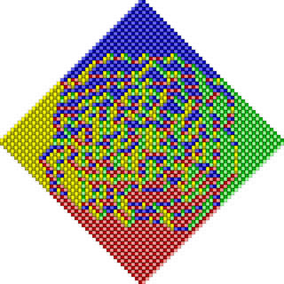
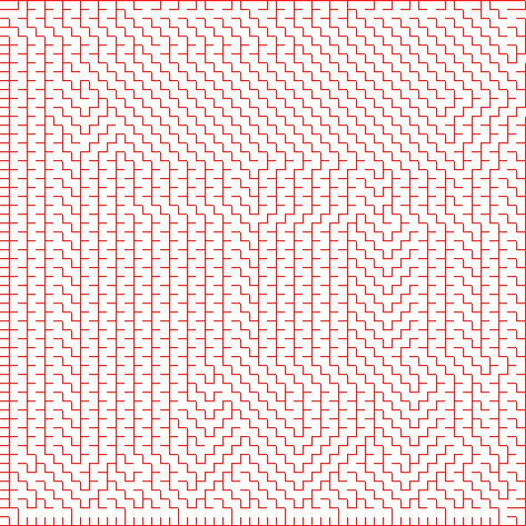
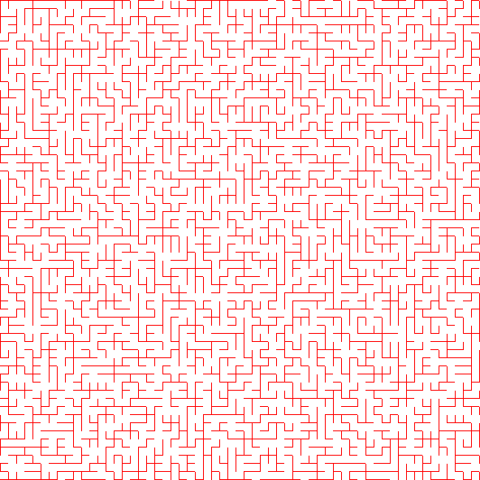
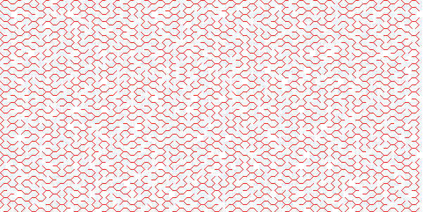

[**catamari**](https://hodgestar.com/catamari/) is a
[C++14](https://en.wikipedia.org/wiki/C%2B%2B14), header-only implementation of
sequential and
[DAG-scheduled](https://en.wikipedia.org/wiki/Directed_acyclic_graph), real and
complex, supernodal sparse-direct
[Cholesky](https://en.wikipedia.org/wiki/Cholesky_decomposition), LDL^T, and
LDL^H factorizations. It similarly contains sequential and DAG-scheduled,
dense and sparse-direct, real and complex,
[Determinantal Point Process](https://en.wikipedia.org/wiki/Determinantal_point_process)
sampling through modified LDL^H factorizations -- and a nonsymmetric dense DPP
sampler based upon a modified LU factorization. The supported precisions are
`float`, `double`, and their double-mantissa extensions.

### Preprint on the techniques behind Catamari
A [preprint](https://arxiv.org/abs/1905.00165)
on Catamari is available, as are the
[slides](https://hodgestar.com/catamari/April8-2019-RoyalSociety.pdf) from a
preceding talk. The paper has been accepted to a special issue of [Philosophical Transactions of the Royal Society A](https://royalsocietypublishing.org/journal/rsta).

### Dependencies
The only strict dependencies for manually including the headers in your project
are:

* [mantis](https://gitlab.com/hodge_star/mantis): A C++14 header-only,
MPL-licensed, implementation of real and complex double-mantissa arithmetic.

* [quotient](https://gitlab.com/hodge_star/quotient): A C++14 header-only,
MPL-licensed, implementation of the (Approximate) Minimum Degree reordering
method.

But, if you would like to make use of the project's build system, the only
strict dependency is:

* [meson](http://mesonbuild.com): "Meson is an open source build system meant
to be both extremely fast, and, even more importantly, as user friendly as
possible." 

Meson will automatically install [quotient](https://gitlab.com/hodge_star/quotient), [Catch2](https://github.com/catchorg/Catch2) (a header-only C++
unit-testing library), and [specify](https://gitlab.com/hodge_star/specify)
(a C++14 header-only, command-line argument processor).

Further, it is strongly recommended that one have optimized implementations of
the Basic Linear Algebra Subprograms (BLAS) and the Linear Algebra PACKage
(LAPACK), such as [OpenBLAS](https://www.openblas.net),
[BLIS](https://github.com/flame/blis), or a proprietary alternative such as
[Intel MKL](https://software.intel.com/en-us/mkl).

### Quickstart
Please see the
[quickstart documentation](https://hodgestar.com/catamari/docs/master/quickstart.html)
for a brief introduction to the library.

### Example drivers
One can factor Matrix Market examples from the Davis sparse matrix collection
via [example/factor_matrix_market.cc](https://gitlab.com/hodge_star/catamari/blob/master/example/factor_matrix_market.cc),
sample a Determinantal Point Process via
[example/dpp_matrix_market.cc](https://gitlab.com/hodge_star/catamari/blob/master/example/dpp_matrix_market.cc),
or factor 2D or 3D Helmholtz Finite Element Method discretizations (with
Perfectly Matched Layer boundary conditions) using
[example/helmholtz_2d_pml.cc](https://gitlab.com/hodge_star/catamari/blob/master/example/helmholtz_2d_pml.cc)
or
[example/helmholtz_3d_pml.cc](https://gitlab.com/hodge_star/catamari/blob/master/example/helmholtz_3d_pml.cc).
An example plane from running the 3D Helmholtz solve using 120 x 120 x 120
trilinear hexahedral elements with a converging lens model spanning 14
wavelengths is shown below:

Examples of running the DPP sampler to generate uniform samples from the space
of spanning trees of a 2D grid graph are given in
[example/uniform_spanning_tree.cc](https://gitlab.com/hodge_star/catamari/blob/master/example/uniform_spanning_tree.cc).
A (lexicographically greedy) maximum likelihood 60x60 result might look like:

while a random example might look like:

An example of a uniform sample of a spanning tree for a hexagonal tiling graph
is given by:

There is also support for sampling from real or complex, nonsymmetric DPP's.
An import example of such processes is the Aztec diamond DPP, whose kernel is
formed via Kenyon's formula. See [example/aztec_diamond.cc](https://gitlab.com/hodge_star/catamari/blob/master/example/aztec_diamond.cc) for more information.
An example output for a tiling of size 40 is given below:

### License
`catamari` is distributed under the
[Mozilla Public License, v. 2.0](https://www.mozilla.org/media/MPL/2.0/index.815ca599c9df.txt).
